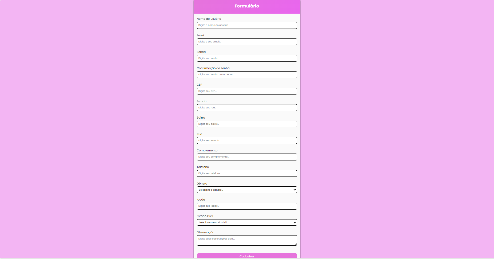

Este repositório contém o código do meu primeiro formulário, criado utilizando o Visual Studio Code. Estou animado(a) para compartilhar este projeto e espero que ele possa ser útil para quem está começando a aprender sobre desenvolvimento web. Este formulário foi desenvolvido como parte do meu aprendizado em HTML, Java e CSS. O objetivo principal é coletar informações básicas de contato, como nome, e-mail, telefone, endereço, entre outros. A estrutura do formulário é simples e fácil de entender, ideal para iniciantes que desejam aprender mais sobre criação de formulários web.